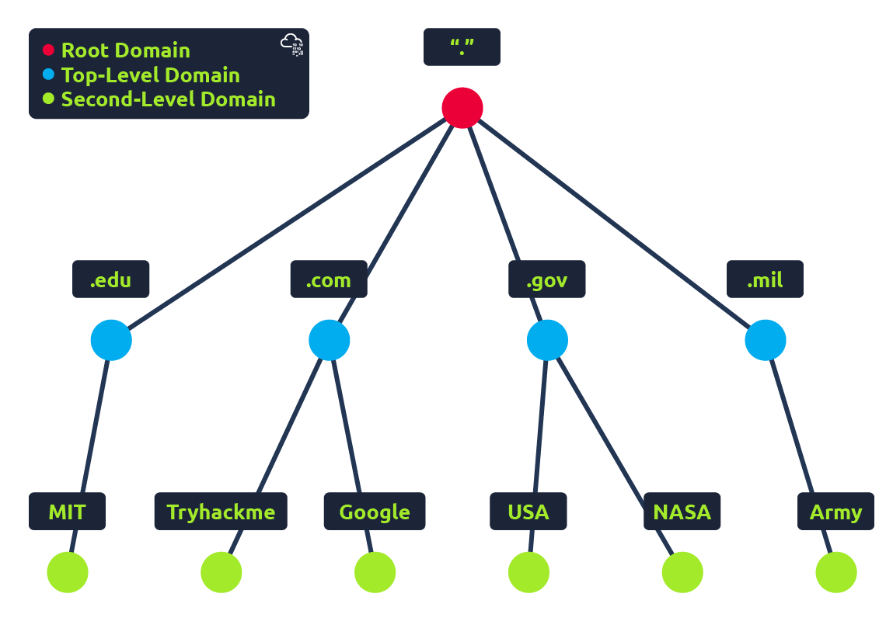
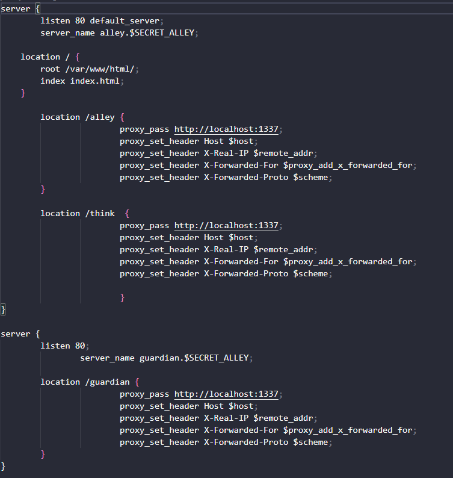

## DNS là gì?

DNS (Domain Name System) cung cấp một đường dẫn đơn giản để giao tiếp với các thiết bị kết nối internet thay vì phải nhớ những dãy số phức tạp. Giống như mỗi ngôi nhà đều có địa chỉ duy nhất để gửi thư trực tiếp đến đó, mỗi máy tính trên internet cũng có địa chỉ riêng để liên lạc gọi là địa chỉ IP (IP address). Một địa chỉ IP có dạng như sau: 104.26.10.229, 4 bộ số từ 0 đến 255 được ngăn cách bởi dấu ".". Khi bạn muốn truy cập website, rất không tiện để có thể nhớ những bộ số phức tạp này, và đó là nơi mà DNS có thể giúp. Thay vì phải nhớ những con số như 104.26.10.229, bạn chỉ cần nhớ _tryhackme.com_.

## Phân cấp tên miền

<figure><figcaption></figcaption></figure>

### TLD (Top-Level Domain)

* TLD là phần bên phải cuối của một tên miền (domain) (ví dụ     thì .vn là TLD hay các TLD phổ biến như .com, .net,...).
* Có 2 loại TLD, đó là gTLD (Generic Top Lever) và ccTLD (Country Code Top Level Domain).
  * gTLD được đặt để người dùng có thể dễ nhận biết được mục đích của tên miền (ví dụ .com sẽ với mục đích thương mại, .org sẽ cho tổ chức (organisation), .edu sẽ dùng cho giáo dục (education), .gov sẽ dùng cho chính phủ (government),...).
  * Còn ccTLD được sủ dụng cho những mục đích nhận biết địa lý (ví dụ .ca là những trang có trụ sở tại Canada, .vn là những trang có trụ sở ở Việt Nam,...).

### Second-Level-Domain (tên miền cấp 2)

* Lấy tryhackme.com làm ví dụ, ở đây .com sẽ là TLD, còn tryhackme sẽ là tên miền cấp 2 (Second Level Domain). Khi đăng ký 1 tên miền, tên miền cấp 2 có giới hạn là 63 ký tự và + TLD và chỉ có thể sử dụng ký tự từ a-z, 0-9 và dấu gạch nối (không thể bắt đầu hoặc kết thúc bằng dấu gạch nối hoặc có dấu gạch nối liên tiếp).

### Subdomain (tên miền con)

* Tên miền con (subdomain) sẽ nằm ở phần bên trái của tên miền cấp 2 (SDL) bằng cách sử dụng dấu chấm để phân cách các tên miền đó. Ví dụ: trong tên miền `admin.tryhackme.com`  phần `admin` là tên miền con.
* Tên miền con có các hạn chế tương tự như second-level-domain, giới hạn ở 63 ký tự và chỉ có thể sử dụng các ký tự a-z, 0-9 và dấu gạch nối (-) (không được bắt đầu hoặc kết thúc bằng dấu gạch nối hoặc có  2 dấu gạch nối liên tiếp).
* Bạn có thể sử dụng nhiều tên miền phụ được phân chia bằng dấu chấm để tạo tên dài hơn, chẳng hạn như jupiter.servers.tryhackme.com. Nhưng độ dài phải được giữ ở mức 253 ký tự trở xuống.
* Không có giới hạn về số lượng tên miền phụ bạn có thể tạo cho tên miền của mình.

## Các loại DNS Record

DNS Record (Bản ghi DNS) hiểu một cách đơn giản là những chỉ dẫn hoặc mục dữ liệu nằm trên các máy chủ DNS có thẩm quyền. Nhiệm vụ chính của chúng là cung cấp thông tin về một domain, chủ yếu là để liên kết một tên miền dễ nhớ đối với con người với một địa chỉ IP mà máy tính có thể hiểu được, cũng như hướng dẫn cách xử lý các yêu cầu liên quan đến tên miền đó.

Tuy nhiên, DNS không chỉ dành cho các trang web và tồn tại nhiều loại bản ghi DNS. Chúng ta sẽ điểm qua một số vấn đề phổ biến nhất mà bạn có thể gặp phải.

#### A Record

Các bản ghi này phân giải thành các địa chỉ IPv4.

* _Ví dụ:_ `104.26.10.229`

#### AAAA Record

Các bản ghi này phân giải thành các địa chỉ IPv6.

* _Ví dụ:_ `2606:4700:20::681a:be5`

#### CNAME Record

Các bản ghi này phân giải thành một tên miền (domain name) khác.

* _Ví dụ:_ Cửa hàng trực tuyến của TryHackMe có tên miền phụ là `store.tryhackme.com`, nó sẽ trả về một CNAME record là `shops.shopify.com`. Sau đó, một truy vấn DNS (DNS request) khác sẽ được thực hiện tới `shops.shopify.com` để tìm ra địa chỉ IP thực sự.

#### MX Record

Các bản ghi này phân giải thành địa chỉ của các máy chủ đảm nhận việc xử lý email cho tên miền mà bạn đang truy vấn.

* _Ví dụ:_ Kết quả trả về của MX record cho `tryhackme.com` sẽ trông giống như `alt1.aspmx.l.google.com`. Các bản ghi này cũng đi kèm với một cờ ưu tiên (priority flag). Cờ này báo cho client biết thứ tự để thử kết nối tới các máy chủ; điều này cực kỳ hoàn hảo cho trường hợp máy chủ chính bị sập và email cần được gửi đến một backup server.

#### TXT Record

Các TXT record là các trường văn bản tự do, nơi có thể lưu trữ bất kỳ dữ liệu dạng văn bản nào. Các bản ghi TXT có rất nhiều công dụng, nhưng một số công dụng phổ biến nhất là để liệt kê các máy chủ có thẩm quyền gửi email thay mặt cho tên miền (điều này giúp ích rất nhiều trong cuộc chiến chống lại thư rác/spam và thư giả mạo - _spoofed email_).&#x20;

Chúng cũng có thể được sử dụng để xác minh quyền sở hữu tên miền khi bạn đăng ký các dịch vụ của bên thứ ba.

Dưới đây là một vài ví dụ:

* `_acme-challenge.example.com TXT "token_value_here"`
* `@ TXT "v=spf1 ip4:192.0.2.0/24 include:_spf.google.com include:amazonses.com ~all"`
* `_dmarc.example.com TXT "v=DMARC1; p=reject; rua=mailto:dmarc-reports@example.com; adkim=s; aspf=s; pct=100"`
* `@ TXT "MS=ms12345678"`

Như bạn có thể thấy, đúng như tên gọi của nó, các bản ghi TXT đơn giản là các chuỗi văn bản .

## Điều gì xảy ra khi bạn thực hiện một DNS request?

1. Khi bạn yêu cầu một tên miền, máy tính của bạn trước tiên sẽ kiểm tra bộ nhớ đệm cục bộ (local cache) để xem bạn có từng tra cứu địa chỉ này gần đây hay không; nếu không, một yêu cầu sẽ được gửi đến Recursive DNS Server của bạn.
2. Recursive DNS Server thường được cung cấp bởi Nhà cung cấp dịch vụ Internet (ISP - Internet Service Provider), nhưng bạn cũng có thể tự chọn một máy chủ riêng. Máy chủ này cũng có một bộ nhớ đệm cục bộ chứa các tên miền đã được tra cứu gần đây. Nếu tìm thấy kết quả ngay tại đây, nó sẽ được gửi trả lại cho máy tính của bạn và truy vấn của bạn kết thúc (điều này rất phổ biến đối với các dịch vụ nổi tiếng và có lượng truy cập lớn như Google, Facebook, Twitter). Nếu không tìm thấy kết quả ở máy chủ đệ quy, một "cuộc hành trình" sẽ bắt đầu để tìm ra câu trả lời chính xác, khởi đầu bằng các máy chủ DNS gốc (root DNS servers) của Internet.
3. Các root DNS servers đóng vai trò như xương sống DNS (DNS backbone) của Internet; nhiệm vụ của chúng là chuyển hướng bạn đến đúng Máy chủ Tên miền Cấp cao nhất (Top Level Domain Server - TLD Server), tùy thuộc vào truy vấn của bạn.&#x20;
   1. Ví dụ: nếu bạn yêu cầu `www.tryhackme.com`, máy chủ gốc sẽ nhận diện Tên miền Cấp cao nhất (TLD) là `.com` và chuyển hướng bạn đến đúng máy chủ TLD chịu trách nhiệm xử lý các địa chỉ `.com`.
4. Máy chủ TLD lưu trữ các bản ghi chỉ ra nơi tìm thấy máy chủ có thẩm quyền (authoritative server) để trả lời truy vấn DNS. Máy chủ có thẩm quyền thường được gọi là máy chủ phân giải tên miền (nameserver) cho tên miền đó.&#x20;
   1. Ví dụ: nameserver của `tryhackme.com` là `kip.ns.cloudflare.com` và `uma.ns.cloudflare.com`. Bạn sẽ thường thấy có nhiều nameserver cho một tên miền để làm phương án dự phòng (backup) trong trường hợp một máy chủ bị sập (goes down).
   2.

       <figure><figcaption></figcaption></figure>
5. Máy chủ DNS có thẩm quyền là máy chủ chịu trách nhiệm lưu trữ các DNS records cho một tên miền cụ thể và là nơi thực hiện bất kỳ cập nhật nào đối với các bản ghi DNS của tên miền đó. Tùy thuộc vào loại bản ghi, bản ghi DNS sau đó sẽ được gửi trở lại cho Máy chủ DNS đệ quy, tại đây một bản sao cục bộ sẽ được lưu vào bộ nhớ đệm (cached) cho các yêu cầu trong tương lai, và cuối cùng được chuyển tiếp (relayed) trở lại cho máy khách (client) ban đầu đã thực hiện truy vấn.

<figure><figcaption></figcaption></figure>

Tất cả các bản ghi DNS đều đi kèm với một giá trị TTL (Time To Live - Thời gian tồn tại). Giá trị này là một con số tính bằng giây, quy định khoảng thời gian mà kết quả phản hồi nên được lưu trữ cục bộ cho đến khi bạn phải tra cứu lại. Việc lưu bộ nhớ đệm (caching) giúp tiết kiệm tài nguyên, tránh việc phải thực hiện truy vấn DNS mỗi khi bạn giao tiếp với một máy chủ. 