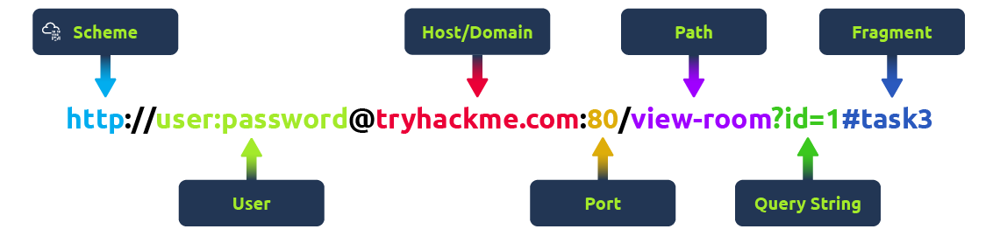
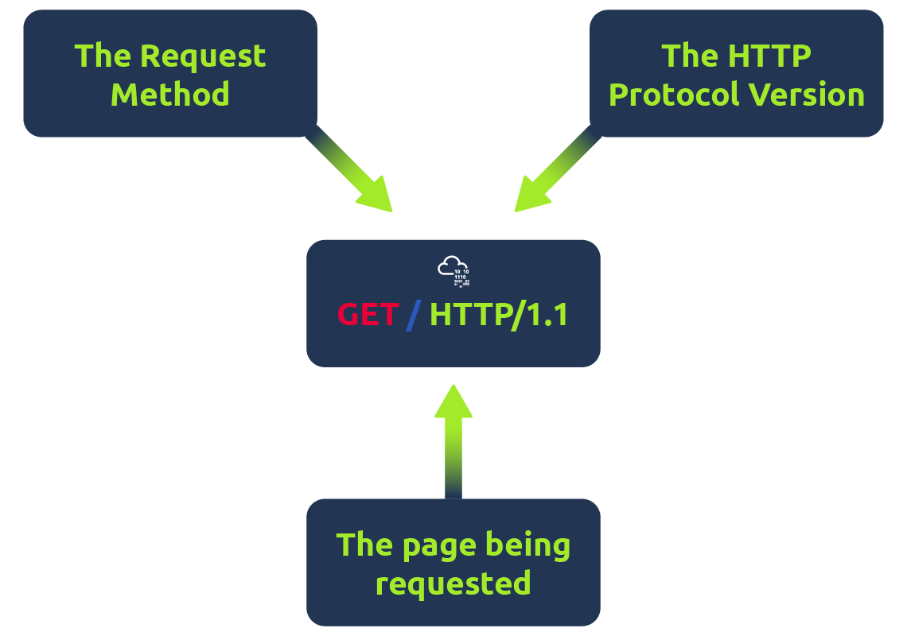

## HTTP là gì? (HyperText Transfer Protocol)

* **HTTP** là những gì được sử dụng khi chúng ta xem một trang web, được phát triển bởi Tim Berners-Lee và đội ngũ của anh ấy từ giữa năm 1989-1991. HTTP là tập hợp các quy tắc được sử dụng để giao tiếp với các máy chủ web để truyền dữ liệu trang web, cho dù đó là HTML, hình ảnh, video,...

## HTTPS là gì? (HyperText Transfer Protocol Secure)

* **HTTPS** là phiên bản bảo mật của HTTP. Dữ liệu HTTPS được mã hóa, vì vậy nó không chỉ ngăn mọi người xem dữ liệu ta đang nhận và gửi, mà còn cung cấp cho ta sự đảm bảo rằng chúng ta đang nói chuyện với máy chủ web chính xác chứ không phải là thứ gì đó mạo danh nó.

## Request và Responses (yêu cầu và phản hồi)

* Khi ta truy cập một trang web, trình duyệt sẽ cần phải tạo ra các requests đến web server cho các tài nguyên như HTML, Images, videos,... và download các responses để hiển thị cho chúng ta. Nhưng trước đó, ta cần nói rõ cho trình duyệt nơi lưu trữ và cách thức để truy cập vào các nguồn tài nguyên này, đây là lúc phải cần đến sự trợ giúp của URLs.
* Nói cách khác, Request là Client yêu cầu Server chuẩn bị những gì để phục vụ cho Client, còn Response là Server phản hồi lại để yêu cầu Client phải chuẩn bị những gì để xử lý dữ liệu.

### HTTP Request

### Vậy URL là gì?

* Nếu như đã truy cập internet thì chắc chắn ta đã dùng qua URL, URL chủ yếu là một hướng dẫn làm sao để truy cập vào nguồn tài nguyên nguyên internet.

<figure><figcaption></figcaption></figure>

Trên đây là một ví dụ về một URL với tất cả các chức năng của nó trên 1 dòng (không phải lúc nào cũng dùng tất cả chức năng cho 1 request).

* Các chức năng gồm:
  * **Scheme:** Đây là hướng dẫn về giao thức để sử dụng cho việc truy cập như HTTP, HTTPS, FTP (File Transfer Protocol).
  * **User:** Một vài dịch vụ yêu cầu phải xác thực để login, ta có thể thêm username và password vào URL để login.
  * **Host:** Tên miền hoặc địa chỉ IP của server muốn truy cập
  * Port: Cổng mà ta muốn kết nối, thường là 80 cho HTTP và 443 cho HTTPS, nhưng cái này có thể được host trên bất kỳ cổng nào từ 1 đến 65535.
  * Path: tên file hoặc vị trí của tài nguyên muốn truy cập.&#x20;
  * Query String: Các bit thông tin bổ sung có thể được gửi đến đường dẫn được yêu cầu. Ví dụ, /blog?**id=1** sẽ cho đường dẫn đến blog mà bạn muốn nhận là bài viết blog có **id** bằng 1.
  * Fragment: Đây là một tham chiếu đến vị trí mà thực tế trang được yêu cầu. Cái này thông thường được dùng cho những trang có nội dung dài và có các phần được chia ra thành các phần và mỗi phần có 1 fragment để người dùng nhanh chóng truy cập đến nó. Ví dụ một trang có 2 phần là part 1 và part 2 thì ta có thể đặt #part1 và #part2 để truy cập nhanh hơn.

### Tạo một Request như thế nào?

Có thể đưa ra yêu cầu cho web server chỉ với một dòng `get / http / 1.1`

<figure><figcaption></figcaption></figure>

## Các Phương thức HTTP (HTTP Methods)

Các HTTP methods là một cách để máy client thể hiện hành động dự định của họ khi thực hiện một HTTP request. Có rất nhiều phương thức HTTP nhưng chúng ta sẽ chỉ đề cập đến những phương thức phổ biến nhất, mặc dù phần lớn thời gian bạn sẽ chỉ làm việc với phương thức GET và POST.

* Yêu cầu GET (GET Request) Phương thức này được sử dụng để lấy (get) thông tin từ một máy chủ web (web server).
* Yêu cầu POST (POST Request) Phương thức này được sử dụng để gửi (submit) dữ liệu đến máy chủ web và có khả năng tạo ra các bản ghi (records) mới.
* Yêu cầu PUT (PUT Request) Phương thức này được sử dụng để gửi dữ liệu đến máy chủ web nhằm cập nhật thông tin đã có.
* Yêu cầu DELETE (DELETE Request) Phương thức này được sử dụng để xóa thông tin/bản ghi khỏi máy chủ web.